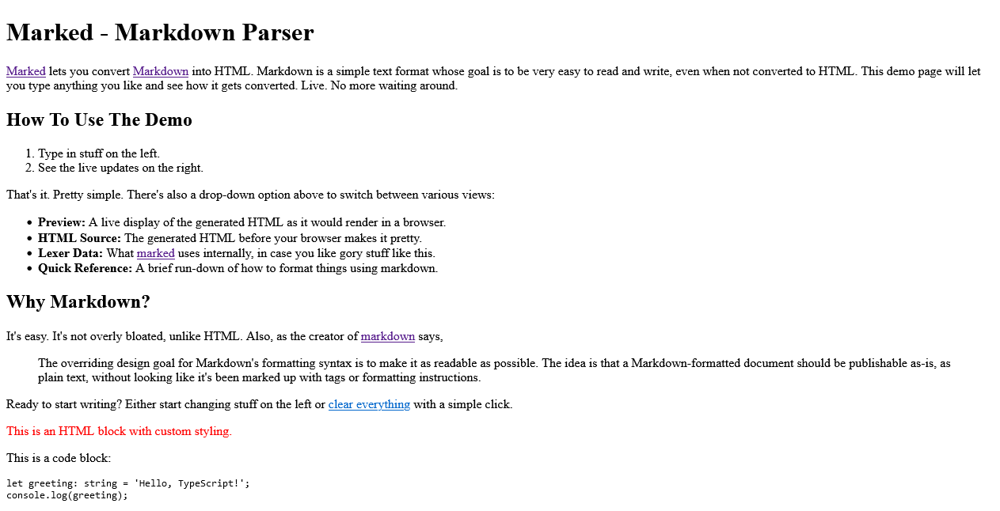
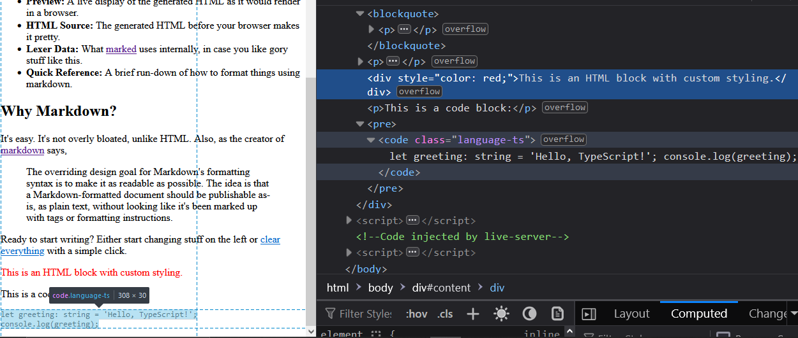

<h2>Motivation</h2>
Experiment with marked.js


<h2>Installation</h2>
In this repo, marked.js is used with a CDN. To install it locally, use:

```bash
npm install marked
```
<h2>Usage</h2> 
Open index.html in the browser and you will see the following



<h2>What is marked.js</h2> <ul> <li>Marked.js is a fast, low-level Markdown parser and compiler that converts Markdown to HTML.</li> <li>It supports all Markdown features and works in browsers, servers, and command-line interfaces.</li> </ul>

<h2>Motivation for marked.js</h2> Built for speed and efficiency, Marked.js aims to parse Markdown without caching or blocking, ensuring lightweight, high-performance rendering across various environments.

<h2>Motivation for Markdown for Me</h2> 
<ul> 
<li>I use it to create posts from Markdown on my personal website, converting Markdown files to HTML posts.</li> 
<li>I use it in post2youtube to convert the repo README.md to HTML.</li> 
</ul>

<h2>Key Markdown Features Supported by Marked.js</h2> 
<ul>
 <li>Headings: #, ##, ###, etc.</li> <li>Paragraphs: Standard text blocks.</li> <li>Emphasis: italic, bold, strikethrough.</li> <li>Lists: Ordered (1. Item) and unordered (- Item).</li> 
 <li>Links: link.</li> 
 <li>Images: !alt text.</li> 
 <li>Blockquotes: > Blockquote.</li> 
 <li>Code Blocks: Indented or fenced with backticks (```).</li> 
 <li>Inline Code: `inline code`.</li> 
 <li>Tables: Using pipes (|) and dashes (-).</li> 
 <li>Horizontal Rules: —, ***, ___.</li> 
 <li>HTML: Inline HTML tags.</li> 
 <li>Escaping: Using backslashes to escape Markdown syntax.</li> 
 </ul>

Remark :  You can also use HTML elements in Markdown files.

<h2>Code</h2>

```javascript
        // Parse the Markdown content to HTML
       const htmlContent = marked.parse(markdown);

       // Insert the HTML content into the div with id "content"
       document.getElementById('content').innerHTML = htmlContent;
```

marked.parse takes the Markdown content and creates HTML from it, as shown in this figure:


